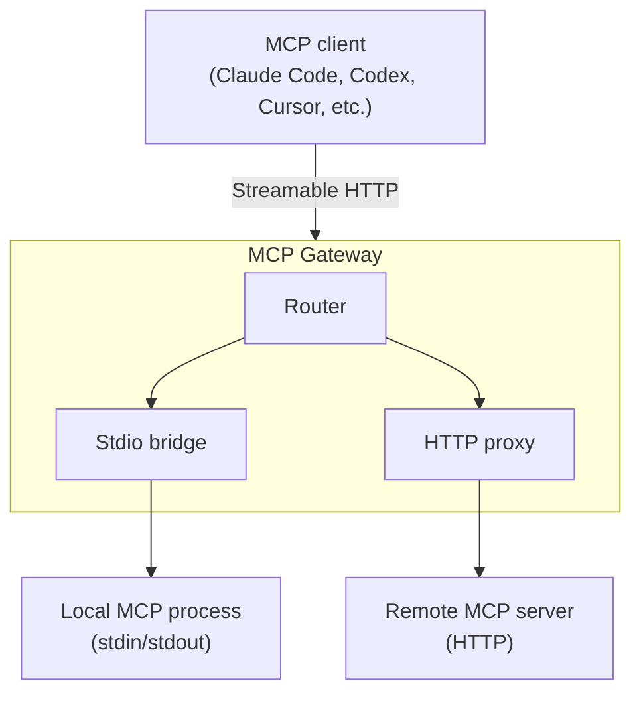

# MCP Gateway

Most MCP servers speak stdio—they read from stdin and write to stdout. That works beautifully when the server runs on the same machine as the client, but it means you can't share a server across machines, put it behind authentication, or manage credentials centrally.

The MCP Gateway bridges that gap. It takes any MCP server—whether it's a local stdio process or a remote HTTP endpoint—and exposes it over Streamable HTTP with a single, consistent interface. One binary, one config file, and every MCP server you run becomes accessible to any MCP client over HTTP.

## How it works



The gateway runs two kinds of backend:

- **Stdio bridge**—spawns a local MCP server as a child process, performs the MCP handshake automatically, and translates between HTTP requests and stdin/stdout. If the process crashes, the gateway restarts it transparently on the next request.

- **HTTP proxy**—forwards requests to a remote MCP server, injecting credentials into the outgoing headers. Useful for fronting remote services with centralised authentication.

Each server gets its own path (`/servers/{name}/mcp`), so you can host as many servers as you need behind a single gateway.

## Quick start

Create a configuration file that describes your MCP servers:

```json
{
	"servers": {
		"filesystem": {
			"transport": "stdio",
			"command": "/usr/local/bin/mcp-filesystem",
			"args": ["--root", "/data"]
		},
		"github": {
			"transport": "http",
			"url": "https://api.github.com/mcp/",
			"credential": "github-token"
		}
	}
}
```

Start the gateway:

```sh
mcp serve --config servers.json
```

That's it. Your MCP servers are now accessible over HTTP:

```sh
# List tools from the filesystem server
curl -X POST http://127.0.0.1:3000/servers/filesystem/mcp \
	-H "Content-Type: application/json" \
	-d '{"jsonrpc":"2.0","id":1,"method":"tools/list","params":{}}'

# Check gateway health
curl http://127.0.0.1:3000/health
```

To connect an MCP client like Claude Code, point it to the gateway's HTTP endpoint:

```json
{
	"mcpServers": {
		"filesystem": {
			"type": "url",
			"url": "http://127.0.0.1:3000/servers/filesystem/mcp"
		}
	}
}
```

## Credentials

MCP servers often need API tokens or other credentials. The gateway resolves credentials by name through a provider chain, so your config files never contain secrets.

When a server references a credential—like `"credential": "github-token"` above—the gateway looks for the value in this order:

1. **Credential files**—a file named `github-token` in the credentials directory
2. **Environment variables**—an environment variable named `MCP_CREDENTIAL_GITHUB_TOKEN`

For HTTP servers, the credential is injected as an `Authorization: Bearer <value>` header by default. You can customise the header and prefix:

```json
{
	"transport": "http",
	"url": "https://api.example.com/mcp/",
	"credential": "api-key",
	"credential_header": "X-Api-Key",
	"credential_prefix": ""
}
```

For stdio servers, the credential is injected as the `MCP_CREDENTIAL` environment variable on the child process.

The credentials directory can be specified on the command line:

```sh
mcp serve --config servers.json --credentials-dir ~/.mcp/credentials
```

This works with any secrets management tool—Vault, cloud key management services, or simple files on disk. The gateway doesn't know or care how the credentials got there.

## TLS

The gateway supports optional TLS for encrypted transport. Certificates are resolved through a discovery chain—the first source that provides valid certificates is used:

1. **Explicit paths**—`--tls-cert` and `--tls-key` CLI flags
2. **Conventional paths**—`~/.mcp/tls/cert.pem` and `key.pem`
3. **Environment variables**—`MCP_TLS_CERT` and `MCP_TLS_KEY`
4. **Self-signed generation**—`--tls-self-signed` flag

If no source provides certificates, the gateway runs plain HTTP.

### Zero-config local TLS

For local development, generate trusted certificates once with [mkcert](https://github.com/FiloSottile/mkcert) and the gateway picks them up automatically:

```sh
mkcert -install
mkcert -cert-file ~/.mcp/tls/cert.pem -key-file ~/.mcp/tls/key.pem \
	localhost 127.0.0.1 ::1
```

Every subsequent `mcp serve` uses TLS with no extra flags. Alternatively, for quick testing without setting up certificates:

```sh
mcp serve --config servers.json --tls-self-signed
```

This generates an ephemeral self-signed certificate in memory. Clients will need to skip certificate verification or trust the generated certificate.

### Production TLS

In production, the gateway typically runs behind a reverse proxy (Caddy, nginx, Envoy) that terminates TLS. The gateway runs plain HTTP in this configuration and the proxy handles certificate management and renewal.

## Trusted proxies and client identity

When the gateway runs behind a reverse proxy that terminates mTLS, the proxy can forward client certificate information to the gateway. The gateway reads this identity—but only from trusted sources.

Configure trusted proxy addresses as CIDR ranges in the gateway configuration:

```json
{
	"trusted_proxies": ["10.0.0.0/8", "172.16.0.0/12"],
	"servers": {}
}
```

When a request arrives from a trusted proxy, the gateway reads client identity from headers following [RFC 9440](https://www.rfc-editor.org/rfc/rfc9440) (`Client-Cert` and `Client-Cert-Chain`). When a request arrives from any other address, these headers are stripped to prevent forgery.

The header names can be customised:

```json
{
	"trusted_proxies": ["10.0.0.0/8"],
	"client_identity_headers": {
		"certificate": "Client-Cert",
		"certificate_chain": "Client-Cert-Chain"
	},
	"servers": {}
}
```

If `trusted_proxies` is absent or empty, forwarded identity headers are ignored on all requests.

## Configuration reference

### Gateway-level fields

| Field | Required | Default | Description |
|-------|----------|---------|-------------|
| `servers` | no | `{}` | Named server definitions |
| `trusted_proxies` | no | `[]` | CIDR ranges of trusted reverse proxies |
| `client_identity_headers` | no | RFC 9440 defaults | Header names for forwarded client identity |

### Server definition

Each server in the `servers` map has these fields:

| Field | Required | Default | Description |
|-------|----------|---------|-------------|
| `transport` | yes | | `"stdio"` or `"http"` |
| `enabled` | no | `true` | Set to `false` to keep the config but skip this server |
| `credential` | no | | Name of a credential to resolve and inject |
| `credential_header` | no | `Authorization` | HTTP header for credential injection (HTTP servers only) |
| `credential_prefix` | no | `Bearer ` | Prefix prepended to the credential value (HTTP servers only) |

### Stdio transport

| Field | Required | Description |
|-------|----------|-------------|
| `command` | yes | Path to the MCP server binary or script |
| `args` | no | Command-line arguments |
| `env` | no | Environment variables injected into the child process |

### HTTP transport

| Field | Required | Description |
|-------|----------|-------------|
| `url` | yes | Full URL of the upstream MCP endpoint |
| `headers` | no | HTTP headers sent with each request |

## Console reference

```
mcp serve [OPTIONS] --config <CONFIG>

Options:
	--config <CONFIG>                Path to the JSON configuration file
	--bind <BIND>                    Listen address [default: 127.0.0.1:3000]
	--credentials-dir <DIR>          Directory containing credential files
	--tls-cert <PATH>                Path to PEM certificate file for TLS
	--tls-key <PATH>                 Path to PEM private key file for TLS
	--tls-self-signed                Generate ephemeral self-signed cert for localhost
	--json                           Output as JSON instead of human-readable text
	-q, --quiet                      Suppress all output except errors
```

## HTTP endpoints

| Method | Path | Description |
|--------|------|-------------|
| `POST` | `/servers/{name}/mcp` | Send an MCP message to the named server |
| `GET` | `/health` | Gateway status and server list |
| `GET` | `/.well-known/mcp-server-card` | Server discovery metadata |

The gateway handles MCP session continuity through the `Mcp-Session-Id` header. If a client sends this header, the gateway routes the request to the same backend instance. If omitted, a new session is created.

## Shutdown

The gateway shuts down gracefully on `SIGINT` (Ctrl+C) or `SIGTERM`. When a shutdown signal arrives, it stops accepting new connections, waits for in-flight requests to complete, and then exits. Stdio server processes are terminated when the gateway process ends.

## Project structure

The gateway is built as a Rust workspace with each concern in its own crate:

| Crate | Purpose |
|-------|---------|
| `transport` | MCP message types and JSON-RPC detection |
| `config` | Server definitions, configuration loading, validation, and credential resolution |
| `credentials` | Credential provider chain (files, environment, commands) |
| `bridge` | Stdio runtime—process spawn, MCP handshake, request forwarding |
| `proxy` | HTTP runtime—upstream request forwarding |
| `router` | Request dispatch by server name to the correct runtime |
| `daemon` | HTTP server with MCP, health, and server card endpoints |
| `tls` | TLS certificate discovery and self-signed generation |
| `output` | Structured output rendering (human, JSON, quiet modes) |
| `console` | Console binary (`mcp serve`) |

## Development

```sh
# Build the gateway
cargo build

# Run all tests (build the test fixture first)
cd tests/fixture && cargo build && cd ../..
cargo test

# Check for warnings
cargo clippy --all-targets

# Format
cargo fmt
```

The project uses tabs for indentation (configured in `rustfmt.toml`).

## Licence

LGPL-3.0-or-later
