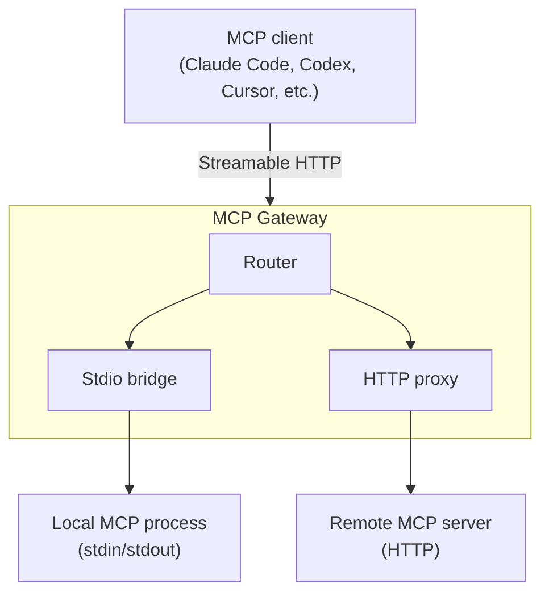

# MCP Gateway

Most MCP servers speak stdio—they read from stdin and write to stdout. That works beautifully when the server runs on the same machine as the client, but it means you can't share a server across machines, put it behind authentication, or manage credentials centrally.

The MCP Gateway bridges that gap. It takes any MCP server—whether it's a local stdio process or a remote HTTP endpoint—and exposes it over Streamable HTTP with a single, consistent interface. One binary, one config file, and every MCP server you run becomes accessible to any MCP client over HTTP.

## How it works



The gateway runs two kinds of backend:

- **Stdio bridge**—spawns a local MCP server as a child process, performs the MCP handshake automatically, and translates between HTTP requests and stdin/stdout. If the process crashes, the gateway restarts it transparently on the next request.

- **HTTP proxy**—forwards requests to a remote MCP server, injecting credentials into the outgoing headers. Useful for fronting remote services with centralised authentication.

Each server gets its own path (`/servers/{name}/mcp`), so you can host as many servers as you need behind a single gateway.

## Quick start

Create a configuration file that describes your MCP servers:

```json
{
	"servers": {
		"filesystem": {
			"transport": "stdio",
			"command": "/usr/local/bin/mcp-filesystem",
			"args": ["--root", "/data"]
		},
		"github": {
			"transport": "http",
			"url": "https://api.github.com/mcp/",
			"credential": "github-token"
		}
	}
}
```

Start the gateway:

```sh
mcp serve --config servers.json
```

That's it. Your MCP servers are now accessible over HTTP:

```sh
# List tools from the filesystem server
curl -X POST http://127.0.0.1:3000/servers/filesystem/mcp \
	-H "Content-Type: application/json" \
	-d '{"jsonrpc":"2.0","id":1,"method":"tools/list","params":{}}'

# Check gateway health
curl http://127.0.0.1:3000/health
```

To connect an MCP client like Claude Code, point it to the gateway's HTTP endpoint:

```json
{
	"mcpServers": {
		"filesystem": {
			"type": "url",
			"url": "http://127.0.0.1:3000/servers/filesystem/mcp"
		}
	}
}
```

## Credentials

MCP servers often need API tokens or other credentials. The gateway resolves credentials by name through a provider chain, so your config files never contain secrets.

When a server references a credential—like `"credential": "github-token"` above—the gateway looks for the value in this order:

1. **Credential files**—a file named `github-token` in the credentials directory
2. **Environment variables**—an environment variable named `MCP_CREDENTIAL_GITHUB_TOKEN`

For HTTP servers, the credential is injected as an `Authorization: Bearer <value>` header by default. You can customise the header and prefix:

```json
{
	"transport": "http",
	"url": "https://api.example.com/mcp/",
	"credential": "api-key",
	"credential_header": "X-Api-Key",
	"credential_prefix": ""
}
```

For stdio servers, the credential is injected as the `MCP_CREDENTIAL` environment variable on the child process.

The credentials directory can be specified on the command line:

```sh
mcp serve --config servers.json --credentials-dir ~/.mcp/credentials
```

This works with any secrets management tool—Vault, cloud key management services, or simple files on disk. The gateway doesn't know or care how the credentials got there.

### When values refresh

The gateway separates two concerns: what credential to use (the `credential` field on a server, fixed in configuration) and what value that credential has right now, fetched through a resolver at the moment of use. That separation drives how rotation propagates:

- **HTTP and SSE servers** consult the resolver on every outgoing request. After the next reload (`SIGHUP`), the next request picks up the new value automatically.
- **Stdio servers** consult the resolver when the child process spawns. The value lives inside the child for its lifetime, so picking up a new value requires the gateway to respawn the bridge: reload triggers this on the next request to that server.

The resolver behind this layer is currently an in-memory map populated at startup (and re-populated on reload) from the provider chain described above. The same interface accommodates future strategies—OAuth client-credentials with cache-backed refresh, dynamic Vault tokens, hardware-backed signing—without changing the configuration shape: a server still references its credential by name.

### Configuration interpolation

A handful of configuration fields support `${VAR}` interpolation against the gateway process's environment. Operators can ship the same configuration file across machines that differ in just a few values without committing the values to the file:

```json
{
	"servers": {
		"github": {
			"transport": "http",
			"url": "https://api.github.com/mcp/",
			"headers": {
				"User-Agent": "${DEPLOYMENT_ID}",
				"X-Region": "${REGION:-eu-west-1}"
			},
			"env": {
				"LOG_LEVEL": "${LOG_LEVEL:-info}"
			}
		}
	}
}
```

The syntax is POSIX-shell-flavoured:

- `${VAR}` expands to the named environment variable's value.
- `${VAR:-fallback}` expands to the value, or to `fallback` when the variable is unset or empty.
- `$$` is the escape for a literal `$`. Write `$${VAR}` to produce the seven-character string `${VAR}` literally.

A reference to a variable that is not set (and not given a default) fails configuration loading with the exact field path inside the document, for example `servers.github.headers.User-Agent`. This is intentionally strict: silent empty-string substitution would mask deployment misconfiguration.

Interpolation is allow-listed: only `env` values and HTTP/SSE `headers` values are scanned. URLs, commands, and command-line arguments are passed through verbatim, since accidental substitution in those positions could expose values where they shouldn't appear (process listings, network logs).

Interpolation runs once at configuration load. After [reload](#reloading-without-restart), the file is re-read and re-interpolated, so picking up an updated environment value is one `SIGHUP` away.

`${secret:NAME}` syntax for referencing the credential chain inside non-credential fields is reserved for a future change; today, credentials are still injected through the `credential` field on each server.

### Bounding helper resolution

Credentials sourced from a helper command (a Vault CLI invocation, a cloud-provider helper, or any subprocess that prints the secret on stdout) are bounded by a wall-clock timeout so a hung helper cannot stall startup. The default is 30 seconds, which is comfortable for cold-start helpers without letting a misconfigured one block the gateway indefinitely. Override it when needed:

```sh
mcp serve --config servers.json --credential-timeout 1m
```

The value accepts humantime strings (`30s`, `1m`, `2m 30s`). Without an explicit flag the gateway reads `MCP_CREDENTIAL_TIMEOUT` from the environment, then falls back to the default. Precedence is `--credential-timeout` then `MCP_CREDENTIAL_TIMEOUT` then 30 seconds. A helper that does not produce output before the timeout fails startup with exit code 78 and a message naming the credential.

### Per-server request timeout

Each stdio server's requests are bounded by a timeout so a wedged server cannot hang a client indefinitely. A request that runs past it is treated as a wedged server: it fails, and the gateway replaces that server's process for the next request. The default is 30 seconds. Raise it for a server with legitimately long-running tools (a large browser operation, a slow query) by setting `request_timeout_seconds` on the server:

```json
{
	"servers": {
		"browser": {
			"transport": "stdio",
			"command": "/usr/local/bin/playwright-mcp",
			"request_timeout_seconds": 120
		}
	}
}
```

The field applies to stdio servers only; HTTP servers ignore it.

### Memory hardening

The gateway tightens two channels through which secrets can leak from a running process:

- **Page locking.** Each `Secret` value's heap bytes are pinned in physical RAM via `mlock` so the kernel cannot page them to swap, where they would outlive the process. Locking is best-effort: a low `RLIMIT_MEMLOCK` (the typical Linux default for unprivileged processes is 64 KiB) leaves the secret unlocked rather than failing startup. Operators who want the guarantee should raise `RLIMIT_MEMLOCK` or grant `CAP_IPC_LOCK` to the gateway process.
- **Core dumps.** At startup the gateway lowers `RLIMIT_CORE` to zero so a crash cannot write live secrets to a post-mortem dump. Pass `--allow-core-dumps` to keep the OS default behaviour when running under a debugger or a crash reporter.

Both controls are defence in depth: `Secret` already redacts itself in `Debug` output, never logs its value, and zeroises its bytes on drop.

## Reloading without restart

The gateway picks up configuration and credential changes in place when it receives `SIGHUP`. This is the default: operators don't need to opt in. Reload re-reads the original `--config` file, re-runs the credential provider chain, and atomically swaps the resolved configuration into the running process. In-flight requests complete on the previous configuration; subsequent requests use the new one.

```sh
kill -HUP $(pgrep mcp)
```

If reload fails—the configuration file became invalid, a credential cannot be resolved, a server runtime cannot be initialised—the previous configuration stays installed and the failure is logged at `warn` level with attribution. The gateway keeps serving traffic.

Stdio bridges respawn on reload. The old router and its child processes drop once any in-flight requests holding the previous configuration finish; the next request to a stdio server spawns a fresh child against the new router, resolving the credential through the new resolver. There is no protocol-level coordination with the child, so a connected client may see one failure for an in-flight stdio session that gets dropped during the swap.

A few top-level fields are read once at startup and a process restart is required to change them:

- `max_body_bytes`
- `trusted_proxies`
- `client_identity_headers`

Issued session IDs persist across reloads, so clients keep their session even when the underlying configuration changes.

To turn the reload trigger off, pass `--no-reload`. With this flag, `SIGHUP` is logged and ignored: the gateway does not fall through to the default termination behaviour, since a hangup signal is rarely an intentional shutdown request for a long-running daemon.

Reload is unavailable on non-Unix platforms; the flag is accepted for surface parity but no signal handler is installed.

## TLS

The gateway supports optional TLS for encrypted transport. Certificates are resolved through a discovery chain—the first source that provides valid certificates is used:

1. **Explicit paths**—`--tls-cert` and `--tls-key` CLI flags
2. **Conventional paths**—`~/.mcp/tls/cert.pem` and `key.pem`
3. **Environment variables**—`MCP_TLS_CERT` and `MCP_TLS_KEY`
4. **Self-signed generation**—`--tls-self-signed` flag

If no source provides certificates, the gateway runs plain HTTP.

### Zero-config local TLS

For local development, generate trusted certificates once with [mkcert](https://github.com/FiloSottile/mkcert) and the gateway picks them up automatically:

```sh
mkcert -install
mkcert -cert-file ~/.mcp/tls/cert.pem -key-file ~/.mcp/tls/key.pem \
	localhost 127.0.0.1 ::1
```

Every subsequent `mcp serve` uses TLS with no extra flags. Alternatively, for quick testing without setting up certificates:

```sh
mcp serve --config servers.json --tls-self-signed
```

This generates an ephemeral self-signed certificate in memory. Clients will need to skip certificate verification or trust the generated certificate.

### Production TLS

In production, the gateway typically runs behind a reverse proxy (Caddy, nginx, Envoy) that terminates TLS. The gateway runs plain HTTP in this configuration and the proxy handles certificate management and renewal.

## Trusted proxies and client identity

When the gateway runs behind a reverse proxy that terminates mTLS, the proxy can forward client certificate information to the gateway. The gateway reads this identity—but only from trusted sources.

Configure trusted proxy addresses as CIDR ranges in the gateway configuration:

```json
{
	"trusted_proxies": ["10.0.0.0/8", "172.16.0.0/12"],
	"servers": {}
}
```

When a request arrives from a trusted proxy, the gateway reads client identity from headers following [RFC 9440](https://www.rfc-editor.org/rfc/rfc9440) (`Client-Cert` and `Client-Cert-Chain`). When a request arrives from any other address, these headers are stripped to prevent forgery.

The header names can be customised:

```json
{
	"trusted_proxies": ["10.0.0.0/8"],
	"client_identity_headers": {
		"certificate": "Client-Cert",
		"certificate_chain": "Client-Cert-Chain"
	},
	"servers": {}
}
```

If `trusted_proxies` is absent or empty, forwarded identity headers are ignored on all requests.

## Inbound authentication

By default the gateway has no inbound authentication: it binds to loopback and trusts every caller, which is the right posture for a local deployment where the only client is you. The moment the gateway is reachable over a network, that posture is wrong—anyone who can reach the port can drive your MCP servers.

Adding an `authentication` section turns the gateway into an [OAuth 2.1](https://datatracker.ietf.org/doc/html/draft-ietf-oauth-v2-1) resource server. Every request to `/servers/*` then has to carry a bearer token that the gateway validates against your authorisation server before the request reaches a backend.

```json
{
	"authentication": {
		"issuer": "https://identity.example.coop",
		"resource": "https://gateway.example.coop",
		"principal_subjects": ["did:arai:example:alice"],
		"server_scopes": {
			"github": ["mcp:invoke:github"]
		},
		"cors": {
			"allowed_origins": ["https://app.example.coop"]
		}
	},
	"servers": {
		"github": {
			"transport": "http",
			"url": "https://api.githubcopilot.com/mcp/",
			"credential": "github-pat"
		}
	}
}
```

The gateway federates only to standards-compliant authorisation servers—it speaks OpenID Connect Discovery and plain OAuth 2.0 metadata, with no server-specific code paths—so the same configuration works against Keycloak, Ory Hydra, a federated identity provider, or [Sinetti's Kivi](https://gitlab.com/sinetti/kivi) proof of concept.

### How a request is admitted

A request to `/servers/{name}/mcp` is admitted only when every check below passes. Each failure maps to a precise response, so a client can tell "you are not authenticated" from "you are authenticated but not allowed here":

1. **A bearer token is present.** A missing or non-`Bearer` `Authorization` header is a `401` with a `WWW-Authenticate` challenge pointing at the protected-resource metadata ([RFC 6750](https://www.rfc-editor.org/rfc/rfc6750)).
2. **The signature verifies** against a key from the issuer's JWKS, using an asymmetric algorithm. The accepted algorithm set is fixed to the asymmetric family (`RS*`, `PS*`, `ES*`, `EdDSA`); `none` and the `HS*` symmetric algorithms are refused outright, closing the algorithm-confusion path. A bad signature is a `401`.
3. **The claims bind to this instance.** The `iss` claim must equal the configured `issuer`, and every element of the `aud` claim must equal the configured `resource`. Per-instance audience binding relies on the authorisation server honouring the [RFC 8707](https://www.rfc-editor.org/rfc/rfc8707) `resource` parameter; the gateway warns at startup if discovery does not advertise support for it.
4. **The principal is admitted.** The token's `sub` must appear in `principal_subjects`. This is the gateway's single-tenancy guard: even a correctly-audienced token from the right issuer is refused if it carries the wrong identity. A non-admitted principal is a `403`.
5. **The scope authorises the server.** The token's `scope` claim must contain at least one of the scopes mapped to the named server in `server_scopes`. A token that authenticates but lacks the server's scope is a `403` `insufficient_scope`.

### Validating tokens: JWT or introspection

The `validation` field chooses how tokens are checked, and both strategies produce the same admitted-or-refused result so nothing downstream depends on the choice:

- **`jwt`** (the default) validates the token locally against the issuer's JWKS. After the keys are cached there is no per-request round trip to the authorisation server.
- **`introspection`** validates each token remotely through an [RFC 7662](https://www.rfc-editor.org/rfc/rfc7662) introspection call. This is the strategy to choose when tokens are opaque or when you need revocation to take effect promptly. It requires a `client_id` and a `client_secret_credential`—the name of a credential resolved through the same provider chain as everything else, so the client secret never sits in the configuration file:

```json
{
	"authentication": {
		"issuer": "https://identity.example.coop",
		"resource": "https://gateway.example.coop",
		"validation": "introspection",
		"client_id": "gateway-prime",
		"client_secret_credential": "gateway-introspection-secret",
		"principal_subjects": ["did:arai:example:alice"],
		"server_scopes": { "github": ["mcp:invoke:github"] },
		"cors": { "allowed_origins": ["https://app.example.coop"] }
	}
}
```

Introspection responses are cached for `introspection_cache_seconds` (default 30) to keep the round-trip count down. When the introspection endpoint is unreachable, `introspection_outage_policy` decides what happens: `fail_closed` (the default) refuses requests, while `serve_cached` keeps honouring cached positive results up to `introspection_max_stale_seconds`—an availability-over-freshness trade-off you opt into deliberately.

### Browser clients and CORS

Browser-native MCP clients need a CORS policy. The `cors` section lists the origins permitted to call the gateway; the wildcard `*` is refused, so you enumerate every origin explicitly. A preflight `OPTIONS` is answered before authentication runs, and the default allowed-header set covers what a browser client needs (`Authorization`, `Content-Type`, `Mcp-Session-Id`, and the trace-context headers). When no `authentication` section is present the gateway admits no cross-origin call at all.

### Trust anchors

HTTPS authenticates the authorisation server against the public certificate-authority system, which a single compromised authority can subvert. For a hosted deployment, pin the things the gateway relies on through `trust_anchors`:

- `discovery_document_sha256`—the expected hash of the discovery document, defending against a substituted document that would redirect the gateway to an attacker's keys.
- `jwks_kid_pins`—the key identifiers the gateway will accept, so an unexpected key is refused even if its signature would otherwise verify.
- `authorization_server_certificate_spki_pins`—[RFC 7469](https://www.rfc-editor.org/rfc/rfc7469) SPKI pins applied to every call the gateway makes to the authorisation server.

Trust anchors are optional so local and experimental deployments can run without them, but their absence is logged at `warn`. A hosted deployment should set at least one.

### Keeping keys and metadata fresh

The gateway keeps its view of the authorisation server current without a restart, three ways:

- **Proactively.** Background timers re-fetch the JWKS every `jwks_cache_seconds` (default 600) and the discovery document every `discovery_cache_seconds` (default 3600). A routine key rotation is picked up before any token needs the new key; a change to the discovery document rebuilds the validator in place.
- **Lazily.** A token signed by a key the cache has not seen triggers a single JWKS refresh on the spot, so a rotation between timer ticks still validates.
- **On `SIGHUP`.** A reload re-fetches discovery, re-resolves the introspection client secret, and flushes the introspection cache entirely—reload is the operator's signal that something material may have changed, including a revocation, and a stale positive cache would defeat revocation-by-reload. If the rebuild fails (the authorisation server is briefly unreachable), the previously loaded validator keeps serving and the failure is logged at `warn`.

A reload that lands mid-request does not change the validator that request was admitted by: each request takes its auth state once at entry and uses that snapshot for its whole lifetime.

### What changes when authentication is on

| Endpoint | Without `authentication` | With `authentication` |
|----------|--------------------------|------------------------|
| `POST /servers/{name}/mcp` | public | bearer token required |
| `GET /.well-known/mcp-server-card` | public | bearer token required—the server inventory maps to scopes |
| `GET /.well-known/oauth-protected-resource` | `404` | the [RFC 9728](https://www.rfc-editor.org/rfc/rfc9728) metadata document, always reachable so a client can begin discovery before authenticating |
| `GET /health`, `GET /ready` | public | public |

### Deployment topologies

The gateway runs the same way in every topology; what differs is what sits around it:

- **Standalone local-loopback**—no `authentication` section, bound to loopback. The development default.
- **Standalone hosted**—an `authentication` section, trust anchors set, TLS terminated by the gateway or a reverse proxy in front of it.
- **With Arai orchestration**—Arai issues the tokens and the gateway validates them; the gateway has no runtime dependency on Arai, it just trusts the issuer.
- **With Shield governance**—Shield's policy decisions ride in the token's scopes, which the gateway enforces per server. Multiple gateways can share one policy.

The gateway is fully standalone in all of them: there is no runtime dependency on Arai, Shield, or any specific authorisation server.

### Authentication fields

The `authentication` section accepts these fields:

| Field | Required | Default | Description |
|-------|----------|---------|-------------|
| `issuer` | yes | | Authorisation server URL; accepts a string or a single-element array |
| `resource` | yes | | This instance's canonical URL, validated as the token `aud` and published in the metadata document |
| `principal_subjects` | yes | | The `sub` values the gateway admits |
| `server_scopes` | no | `{}` | Map of server name to the scopes that authorise it; every configured server needs an entry |
| `cors` | yes | | Browser CORS policy (`allowed_origins`, `allowed_headers`, `max_age_seconds`) |
| `validation` | no | `jwt` | `jwt` or `introspection` |
| `client_id` | introspection only | | OAuth client identifier presented at the introspection endpoint |
| `client_secret_credential` | introspection only | | Name of the credential holding the introspection client secret |
| `clock_skew_seconds` | no | `30` | Tolerance applied to `exp` and `nbf`; capped at `300` |
| `jwks_cache_seconds` | no | `600` | Proactive JWKS refresh cadence |
| `discovery_cache_seconds` | no | `3600` | Proactive discovery refresh cadence |
| `introspection_cache_seconds` | no | `30` | Lifetime of cached introspection responses |
| `introspection_outage_policy` | no | `fail_closed` | `fail_closed` or `serve_cached` when the introspection endpoint is unreachable |
| `introspection_max_stale_seconds` | no | `0` | Maximum staleness `serve_cached` tolerates |
| `trust_anchors` | no | | Discovery hash, JWKS `kid`, and certificate SPKI pins |
| `resource_documentation_url` | no | | Published as `resource_documentation` in the metadata document |

The full design and rationale live in Arai Architecture RFC-0014.

## Configuration reference

### Gateway-level fields

| Field | Required | Default | Description |
|-------|----------|---------|-------------|
| `servers` | no | `{}` | Named server definitions |
| `trusted_proxies` | no | `[]` | CIDR ranges of trusted reverse proxies |
| `client_identity_headers` | no | RFC 9440 defaults | Header names for forwarded client identity |
| `authentication` | no | | Inbound OAuth 2.1 resource-server configuration; see [Inbound authentication](#inbound-authentication) |

### Server definition

Each server in the `servers` map has these fields:

| Field | Required | Default | Description |
|-------|----------|---------|-------------|
| `transport` | yes | | `"stdio"` or `"http"` |
| `enabled` | no | `true` | Set to `false` to keep the config but skip this server |
| `credential` | no | | Name of a credential to resolve and inject |
| `credential_header` | no | `Authorization` | HTTP header for credential injection (HTTP servers only) |
| `credential_prefix` | no | `Bearer ` | Prefix prepended to the credential value (HTTP servers only) |

### Stdio transport

| Field | Required | Description |
|-------|----------|-------------|
| `command` | yes | Path to the MCP server binary or script |
| `args` | no | Command-line arguments |
| `env` | no | Environment variables injected into the child process |

### HTTP transport

| Field | Required | Description |
|-------|----------|-------------|
| `url` | yes | Full URL of the upstream MCP endpoint |
| `headers` | no | HTTP headers sent with each request |

## Console reference

```
mcp serve [OPTIONS] --config <CONFIG>

Options:
	--config <CONFIG>                Path to the JSON configuration file
	--bind <BIND>                    Listen address [default: 127.0.0.1:3000]
	--credentials-dir <DIR>          Directory containing credential files
	--credential-timeout <DURATION>  Helper command timeout (default 30s)
	--tls-cert <PATH>                Path to PEM certificate file for TLS
	--tls-key <PATH>                 Path to PEM private key file for TLS
	--tls-self-signed                Generate ephemeral self-signed cert for localhost
	--no-reload                      Ignore SIGHUP rather than reloading configuration
	--allow-core-dumps               Keep RLIMIT_CORE at the OS default (off by default)
	--json                           Output as JSON instead of human-readable text
	-q, --quiet                      Suppress all output except errors
```

## HTTP endpoints

| Method | Path | Description | Authenticated |
|--------|------|-------------|---------------|
| `POST` | `/servers/{name}/mcp` | Send an MCP message to the named server | when configured |
| `GET` | `/health` | Gateway liveness | never |
| `GET` | `/ready` | Readiness and server list | never |
| `GET` | `/.well-known/mcp-server-card` | Server discovery metadata | when configured |
| `GET` | `/.well-known/oauth-protected-resource` | Protected-resource metadata ([RFC 9728](https://www.rfc-editor.org/rfc/rfc9728)); `404` until `authentication` is configured | never |

The "Authenticated" column reflects behaviour once an [`authentication`](#inbound-authentication) section is configured; without it the gateway is fully public on loopback.

The gateway handles MCP session continuity through the `Mcp-Session-Id` header. If a client sends this header, the gateway routes the request to the same backend instance. If omitted, a new session is created.

## Shutdown

The gateway shuts down gracefully on `SIGINT` (Ctrl+C) or `SIGTERM`. When a shutdown signal arrives, it stops accepting new connections, waits for in-flight requests to complete, and then exits. Stdio server processes are terminated when the gateway process ends.

## Project structure

The gateway is built as a Rust workspace with each concern in its own crate:

| Crate | Purpose |
|-------|---------|
| `transport` | MCP message types and JSON-RPC detection |
| `config` | Server definitions, configuration loading, validation, and credential resolution |
| `credentials` | Credential provider chain (files, environment, commands) |
| `bridge` | Stdio runtime—process spawn, MCP handshake, request forwarding |
| `proxy` | HTTP runtime—upstream request forwarding |
| `router` | Request dispatch by server name to the correct runtime |
| `daemon` | HTTP server with MCP, health, and server card endpoints |
| `tls` | TLS certificate discovery and self-signed generation |
| `output` | Structured output rendering (human, JSON, quiet modes) |
| `console` | Console binary (`mcp serve`) |

## Development

```sh
# Build the gateway
cargo build

# Run all tests (build the test fixture first)
cd tests/fixture && cargo build && cd ../..
cargo test

# Check for warnings
cargo clippy --all-targets

# Format
cargo fmt
```

The project uses tabs for indentation (configured in `rustfmt.toml`).

### Cryptographic provider

The gateway's TLS relies on rustls, which needs a cryptographic provider. Exactly one is compiled per build, chosen with a feature on the console crate:

- **`ring`** (default): no C toolchain, wasm-capable. This is what a plain `cargo build` uses.
- **`aws-lc-rs`**: the rustls default provider. Build it with:

  ```sh
  cargo build -p mcp-gateway-console --no-default-features --features "self-signed,aws-lc-rs"
  ```

- **`fips`**: builds on `aws-lc-rs` plus rustls's FIPS module. It needs the FIPS build toolchain and is not exercised by a normal build.

`scripts/check-single-rustls-provider.sh` verifies that exactly one provider is linked, and is meant to run in CI for each flavour.

## Licence

LGPL-3.0-or-later
