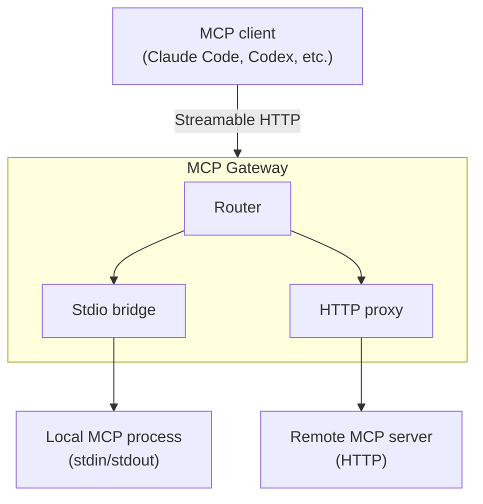

# MCP Gateway

HTTP gateway for Model Context Protocol servers. Routes MCP requests to backend server runtimes, bridging stdio-based servers to Streamable HTTP and proxying remote MCP endpoints through a single authenticated entry point.

## Architecture



The gateway accepts MCP requests over Streamable HTTP and dispatches them to the appropriate backend runtime:

- **Stdio bridge** — spawns a local MCP server process, performs the MCP handshake, and translates between HTTP and stdin/stdout.
- **HTTP proxy** — forwards requests to a remote MCP server endpoint with header injection.

## Development

```sh
cargo build
cargo test
cargo clippy --all-targets
cargo fmt
```

The project uses tabs for indentation (configured in `rustfmt.toml`).

## Licence

LGPL-3.0-or-later
